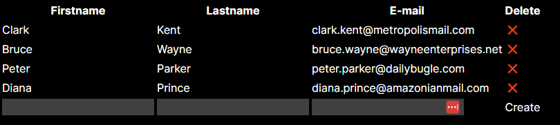

# BarBillTracker
This application build on MERN is used to track the consumtion of members at a bar. Afterwards it generates the bill for all members for a simplified admin.

Currently you are able to create and delete users.

